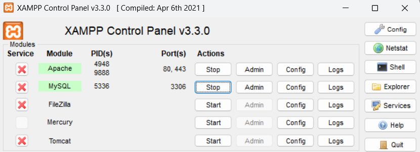

# Hướng Dẫn Chạy Chương Trình

## Các bước thực hiện sau khi clone thành công về

1. Chạy lệnh: `composer install`
2. Đổi tên file: `.env.xample` thành `.env`
3. Chạy lệnh: `php artisan key:generate`
4. Chạy lệnh: `php artisan migrate`
5. Chạy lệnh: `php artisan db:seed`
6. Chạy lệnh: `php artisan serve` 

## Ghi chú
- Sản phẩm được thiết kế bằng Laravel
- Đảm bảo bật XAMPP trong suốt quá trình thực hiện các bước trên:
  - Chạy Apache
  - Chạy MySQL
 
- Đảm bảo bạn đã cài đặt các công cụ sau trước khi thực hiện:
  - **PHP**
  - **Laravel**
  - **XAMPP**: [Tải tại đây](https://sourceforge.net/projects/xampp/files/XAMPP%20Windows/8.2.12/xampp-windows-x64-8.2.12-0-VS16-installer.exe/download)
  - **Composer**: [Tải tại đây](https://getcomposer.org/Composer-Setup.exe)

- Kiểm tra kết nối cơ sở dữ liệu trong file `.env` trước khi chạy lệnh `migrate` và `db:seed`.

## Các lỗi có thể gặp

## Tài khoản đăng nhập cho các role

- **Giám đốc**:
  - Tài khoản: phat@gmail.com
  - Mật khẩu: 123
- **Quản lý nhân sự**:
  - Tài khoản: Hai123@gmail.com
  - Mật khẩu: 123
- **Quản lý kế toán**:
  - Tài khoản: thuphuong@gmail.com
  - Mật khẩu: 123